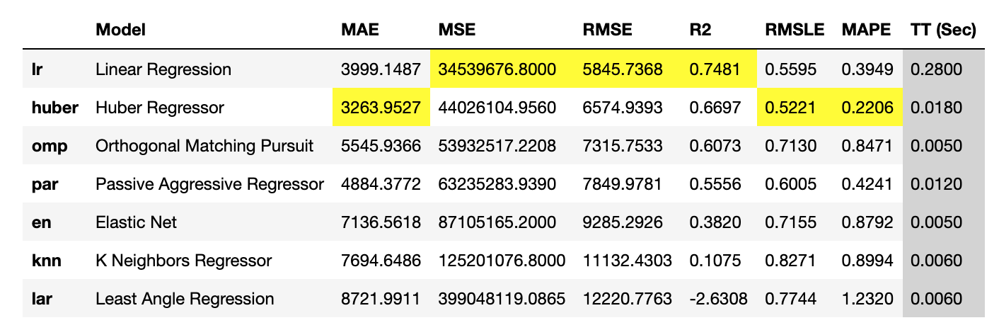

<label class="widget-label" title="" style="display: none;"></label>

<label class="widget-label" title="" style="display: none;"></label>
<h1><b>
Medical Cost Personal Datasets
</b></h1>

<label class="widget-label" title="" style="display: none;"></label>
<h3>
Insurance Forecast by using Linear Regression
</h3>

<label class="widget-label" title="" style="display: none;"></label>

<label class="widget-label" title="" style="display: none;"></label>

<label class="widget-label" title="" style="display: none;"></label>

<table style="width: 100%; border-collapse: collapse; border-style: solid; border-color: black;" border="2" cellpadding="25">
<tbody>
<tr>
<td style="width: 100%;">
<h2 style="text-align: justify;">About the Dataset</h2>

This dataset was originally published in book <strong>"Machine Learning with R by Brett Lantz"</strong>. It consists of 1338 records and 7 features for prediction of insurance charges in United States. The 6 independent features can be used to predict the dependent feature 'charges'.

<strong>The dataset contains 6 independent features as listed below:</strong>

<ul style="text-align: justify;">
<li>

<strong>age:</strong> age of primary beneficiary

</li>
<li>

<strong>sex:</strong> insurance contractor gender, female, male

</li>
<li>

<strong>bmi:</strong> Body mass index, providing an understanding of body, weights that are relatively high or low relative to height, objective index of body weight (kg / m ^ 2) using the ratio of height to weight, ideally 18.5 to 24.9

</li>
<li>

<strong>children:</strong> Number of children covered by health insurance / Number of dependents

</li>
<li>

<strong>smoker:</strong> smoker/non-smoker

</li>
<li>

<strong>region:</strong> the beneficiary's residential area in the US, northeast, southeast, southwest, northwest

</li>
<li>

<strong>charges:</strong> Individual medical costs billed by health insurance

</li>
</ul>

These features are used to predict the yearly charges incurred (in $) by an individual for availing the insurance facility.

</td>
</tr>
</tbody>
</table>
<h3 style="text-align: justify;">Sample records from the dataset:</h3>
<table style="border-collapse: collapse; width: 455pt; border-style: solid; border-color: black;" border="1" width="455pt" cellspacing="0" cellpadding="0">
<tbody>
<tr style="height: 16.0pt;">
<td style="height: 16pt; width: 84.4375px; text-align: center;" height="67">age</td>
<td style="width: 85.2344px; text-align: center;">sex</td>
<td style="width: 85.3125px; text-align: center;">bmi</td>
<td style="width: 85.5312px; text-align: center;">children</td>
<td style="width: 85.3906px; text-align: center;">smoker</td>
<td style="width: 86.1094px; text-align: center;">region</td>
<td style="width: 86.6406px; text-align: center;">charges</td>
</tr>
<tr style="height: 16pt; text-align: center;">
<td style="height: 16pt; width: 84.4375px; text-align: center;" align="right" height="67">19</td>
<td style="width: 85.2344px; text-align: center;">female</td>
<td style="width: 85.3125px; text-align: center;" align="right">27.9</td>
<td style="width: 85.5312px; text-align: center;" align="right">0</td>
<td style="width: 85.3906px; text-align: center;">yes</td>
<td style="width: 86.1094px; text-align: center;">southwest</td>
<td style="width: 86.6406px; text-align: center;" align="right">16884.924</td>
</tr>
<tr style="height: 16pt; text-align: center;">
<td style="height: 16pt; width: 84.4375px; text-align: center;" align="right" height="67">18</td>
<td style="width: 85.2344px; text-align: center;">male</td>
<td style="width: 85.3125px; text-align: center;" align="right">33.77</td>
<td style="width: 85.5312px; text-align: center;" align="right">1</td>
<td style="width: 85.3906px; text-align: center;">no</td>
<td style="width: 86.1094px; text-align: center;">southeast</td>
<td style="width: 86.6406px; text-align: center;" align="right">1725.5523</td>
</tr>
<tr style="height: 16pt; text-align: center;">
<td style="height: 16pt; width: 84.4375px; text-align: center;" align="right" height="67">28</td>
<td style="width: 85.2344px; text-align: center;">male</td>
<td style="width: 85.3125px; text-align: center;" align="right">33</td>
<td style="width: 85.5312px; text-align: center;" align="right">3</td>
<td style="width: 85.3906px; text-align: center;">no</td>
<td style="width: 86.1094px; text-align: center;">southeast</td>
<td style="width: 86.6406px; text-align: center;" align="right">4449.462</td>
</tr>
<tr style="height: 16pt; text-align: center;">
<td style="height: 16pt; width: 84.4375px; text-align: center;" align="right" height="67">33</td>
<td style="width: 85.2344px; text-align: center;">male</td>
<td style="width: 85.3125px; text-align: center;" align="right">22.705</td>
<td style="width: 85.5312px; text-align: center;" align="right">0</td>
<td style="width: 85.3906px; text-align: center;">no</td>
<td style="width: 86.1094px; text-align: center;">northwest</td>
<td style="width: 86.6406px; text-align: center;" align="right">21984.4706</td>
</tr>
<tr style="height: 16pt; text-align: center;">
<td style="height: 16pt; width: 84.4375px; text-align: center;" align="right" height="67">32</td>
<td style="width: 85.2344px; text-align: center;">male</td>
<td style="width: 85.3125px; text-align: center;" align="right">28.88</td>
<td style="width: 85.5312px; text-align: center;" align="right">0</td>
<td style="width: 85.3906px; text-align: center;">no</td>
<td style="width: 86.1094px; text-align: center;">northwest</td>
<td style="width: 86.6406px; text-align: center;" align="right">3866.8552</td>
</tr>
</tbody>
</table>

<label class="widget-label" title="" style="display: none;"></label>

<label class="widget-label" title="" style="display: none;"></label>

<h2>Hybrid Approach Used: Clustering + Linear Regression</h2>

A variety of different regression models were tested for the given dataset including Linear, Huber, Orthogonal Matching Point, etc. (refer table below) and linear regression (multivarialte) was found to be the best model among all applied models having a R2 score of 0.7466. In statistics, linear regression is a linear approach for modelling the relationship between a scalar response and one or more explanatory variables.

&nbsp;

<label class="widget-label" title="" style="display: none;"></label>

<label class="widget-label" title="" style="display: none;"></label>

<label class="widget-label" title="" style="display: none;"></label>

<h4>* LM: Linear Model</h4>

Combining with clustering, and applying a hybrid approach (refer figure above) the R2 square is furthur increased by 12.06% to 0.83671. The approach consists of splitting the original dataset into diffrent clusters and then using a linear model for each cluster. The optimal number of clusters have been identified by varing cluster numbers from 2 to 30, and analysing the R2 score for predictiond on test data. For new unseen data, firstly the cluster is predicted and then the linear model corresponding to that particular cluster is applied to obtain the final output.

&nbsp;

<label class="widget-label" title="" style="display: none;"></label>

<label class="widget-label" title="" style="display: none;"></label>